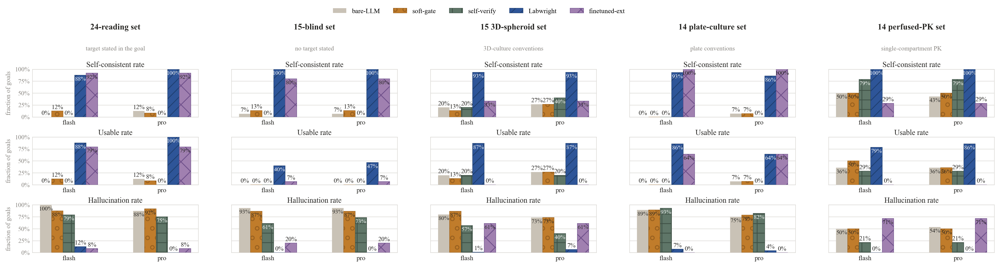

# 🧪 Labwright

**The AI bench copilot that gets your numbers right.**

[](LICENSE)
[]()
[](https://github.com/qgeng1465/labwright/actions)
[]()


Frontier LLMs hallucinate ~100 % of the derived numbers in a wet-lab design.
Labwright doesn't let them: the model proposes **raw inputs**, deterministic
calculators compute every derived number, and a verifier **re-proves each one**
before the design is accepted. One yardstick, one rule for every row
([`eval/`](eval/README.md)):

| system | how derived numbers are produced | usable designs (24 reading goals) | hallucination |
|---|---|---|---|
| bare frontier LLM (the status quo) | written from memory | **0–12 %** | ~0.9–1.0 |
| "check yourself" / LLM-as-verifier | self-derived (soft-gate, self-verify) | **0 %** — the second pass actively corrupts the first | ~0.75–1.0 |
| **Labwright** | calculators compute; verifier re-proves | **88–100 %** | **0.000** |


**Built for organ-on-chip and perfused cell culture first. General wet-lab by design.**

👉 **Try it:** `pip install -e .[agent]` (PyPI release pending) ·
[Open in Colab](https://colab.research.google.com/github/qgeng1465/labwright/blob/main/colab/labwright_demo.ipynb) ·
[Web demo](hf_space/) · reverse-verify a *published* protocol:
`labwright verify-protocol examples/verify_protocol.json`

**Who this is for.**
- *Bench scientists* — paste a paper's geometry/flow/shear and get a
  discrepancy check in 3 seconds (`labwright verify-protocol`), or describe an
  experiment and get a verified SOP.
- *AI-for-science researchers* — a hard-gate agent architecture with a
  reproducible benchmark and an honestly stated boundary ([`eval/`](eval/README.md)).
- *Contributors* — adding a domain is a folder, not a fork ([CONTRIBUTING.md](CONTRIBUTING.md)).

---

## Why this exists

More than half of published life-science results can't be reproduced
([reproducibility crisis, ~$28B/yr](https://pmc.ncbi.nlm.nih.gov/articles/PMC11537370/)).
A big driver: experiment designs with wrong numbers — an unphysiological shear
stress, an underpowered replicate count, a cytotoxic DMSO concentration — that
survive peer review because nobody checks the arithmetic.

LLMs make this worse. Asked to design a perfusion experiment, a frontier model
will confidently write "shear stress 0.25 Pa" whether or not that follows from
the geometry it chose. **An LLM that writes numbers from memory is a
hallucination engine.**

## The gap today's wet-lab LLMs haven't closed

An LLM can write you a beautiful protocol. But **every number in it** — shear
stress, flow rate, seeding density, DMSO carry-over, replicate count — is a
*derived* quantity: it only exists once you choose a geometry, a flow, a cell
density. Models write these from memory, and memory can't do arithmetic.

We looked at every closely-related system we could run. None of them closes
this gap — Labwright is the one that does:

| System | How it handles protocol numbers | Can it *prove* a number follows from its own inputs? |
|---|---|---|
| **Thoth** (ICLR 2026) | 8B model trained on 12k+ real protocols with a structured reward to write *plausible* protocol text | No — verification is a learned, model-internal reward |
| **BPL-COGEN** (bioRxiv 2026) | compiler gives 95.1% *type* fidelity on 300 Nature Protocols | No — checks structure, not physics |
| **ChemCrow** (Nature Mach. Intell.) | LLM agent for chemistry; verification delegated to the LLM as judge | No — the judge can't be trusted for arithmetic |
| **LLM self-check** ("check yourself") | the model re-derives its own numbers | No — we measured it: the second pass actively corrupts the first |
| **MMFT OoC Designer** (IEEE TCAD 2024) | deterministic organ-chip *geometry* synthesis | No LLM, no natural language, no cell/dosing/stats layer |
| **Labwright** (this repo) | LLM proposes **raw inputs**; deterministic calculators compute every derived number; the verifier **re-derives each one** | **Yes — a hard gate.** No number enters a design unless a calculator produced it and the verifier re-proved it |

**Labwright inverts the responsibility: the model cannot type a number the
calculators didn't check — a hard gate, not a soft reward.** And the *same*
calculators run backwards: paste a published paper's geometry, flow and claimed shear, and
Labwright recomputes the claims and flags anything that doesn't follow from the
paper's own inputs — a reproducibility checker in three seconds
([`labwright verify-protocol`](#quickstart)).

**Measured on one yardstick.** None of the systems above publishes a measure of
whether its output numbers follow from its own inputs — we do (the table at the
top; full protocol in [`eval/`](eval/README.md)). The two that could
conceivably be run are not runnable here (BPL's released pipeline needs ~60 GB
of GPU memory; MMFT is a deterministic geometry synthesizer, not an LLM), so we
state that plainly instead of claiming a head-to-head. One honest boundary,
stated in [the benchmark](eval/README.md): verification is *necessary, not
sufficient*. Labwright proves numbers are internally consistent; it cannot
supply physiology the model doesn't know. The blind-set usable rate collapses
to 25–33 % (11–22 % on goals with no hint at all) for exactly that reason. That
boundary is the real research frontier, and closing it is where this project is
headed.

## What you get

| | Without Labwright | With Labwright |
|---|---|---|
| "shear stress" | guessed from memory | `6·μQ/(w·h²)` — recomputed from your geometry |
| "n per group" | made up | power analysis from your effect size & σ |
| DMSO carry-over | "negligible" | `working/stock`, flagged if > 0.5% v/v |
| internal consistency | unverifiable | every derived field re-checked by the verifier |

## Demo

```
$ labwright design "liver-chip model of drug-induced injury at sinusoidal shear"
✓ all derived numbers verified against the calculators

# SOP: Model drug-induced liver injury in a perfused liver-chip at sinusoidal shear

## 2. Perfusion
- Flow rate: **2.00 µL/min** per channel
- Wall shear stress: **0.050 Pa** (0.50 dyn/cm²)
- Reynolds number: 0.13 (laminar, Re << 2300)
- Pressure drop: 20.0 Pa — verify the pump can hold this

## 3. Cell seeding
- Seeding density: 100000 cells/cm² over 0.080 cm²
- **Seed 8000 cells** per channel

## 4. Compound dosing
- Working dose: **0.1 mM** (Acetaminophen)
- DMSO carry-over: 0.10% v/v  ✅

## 5. Statistical design
- **16 biological replicates per group** (α=0.05, power=0.80, effect=1σ)
```

The model chose the goal, the geometry and the assumptions. Every bolded number
was computed by `labwright.calc` and passed `labwright.verify`.

## Quickstart

```bash
pip install -e .[agent]        # PyPI release pending (name reserved)
export DEEPSEEK_API_KEY=sk-... # any OpenAI-compatible API works
labwright design "lung-on-chip at alveolar-capillary shear (~0.03 Pa)"
```

3 seconds to a verified design. `labwright tools` lists every calculator the
agent can call; `labwright design "..." --output sop` prints just the protocol.

**Sanity-check a published protocol** — the reverse of design. Given a paper's
geometry, flow and claimed shear/Re/n, Labwright recomputes every number and
flags any that don't follow from the paper's own inputs:

```bash
labwright verify-protocol examples/verify_protocol.json
# shear_pa   computed 0.05  claimed 0.5  rel.err 9.000  discrepancy
# → 1 claimed value(s) do not follow from the reported inputs.
```

**Models.** Default brain is `deepseek-v4-flash` (cheap, thinking disabled —
the arithmetic lives in the calculators, not the model). Any OpenAI-compatible
model works via `LABWRIGHT_MODEL`; both `deepseek-v4-flash` and
`deepseek-v4-pro` are benchmarked in `results/`.

**Run it in your browser, no setup:**

[](https://colab.research.google.com/github/qgeng1465/labwright/blob/main/colab/labwright_demo.ipynb)
— [colab/labwright_demo.ipynb](colab/labwright_demo.ipynb) installs Labwright,
designs a perfused liver-chip, and reverse-verifies a protocol's numbers.

Web demo (Hugging Face Space): [`hf_space/`](hf_space/) — see
[`hf_space/PUBLISH.md`](hf_space/PUBLISH.md) to deploy.

## How it works


The goal goes in; a design whose every number was computed by
`labwright.calc` and re-proved by `labwright.verify` comes out. The agent
writes the narrative; the arithmetic is exiled to unit-tested code.

- **`calc/`** — pure, unit-tested engineering math (microfluidics, cell, dosing,
  stats). The moat: an LLM cannot compute these reliably, but a calculator can.
- **`agent/`** — a ReAct loop over the tool registry. It may call any
  calculator and must finish by calling `submit_design`. Prose answers are
  refused: *"numbers you type are not trusted."*
- **`verify/`** — re-runs every governing equation on the agent's own inputs and
  rejects designs that don't match. This is what makes the "no hallucinated
  numbers" claim checkable, not just asserted.
- **`extract/`** — a fine-tuned goal→raw-inputs model (Qwen2.5-1.5B LoRA,
  `extract/pipeline.py`): the natural-language goal seeds the raw inputs the
  calculators then check, so a design can be generated without an agent
  round-trip. Eval (`extract/eval.py`): JSON parse **1.0**, extract→verify
  consistency **0.998**, field recovery **0.72** on 400 rows + 12 blind goals.
- **`schema/` + `published.py`** — the verified design plan types
  (`DesignPlan`, `CulturePlan`, …); `published.py` runs the *same* calculators
  backwards over a published protocol's own inputs. A new domain is a
  `calc/` module + a `tools.py` registration, not a fork.

## Related work & differentiation

We are not the first to put LLMs on wet-lab design — and we say so plainly.
[The comparison table above](#the-gap-todays-wet-lab-llms-havent-closed) puts
Labwright next to every closely-related system we could run (Thoth, BPL-COGEN,
ChemCrow, LLM self-check, MMFT). Three of them define the space; Labwright's
claim is narrower and sharper: **no number enters a design unless a
deterministic calculator computed it and the verifier re-proved it.** The LLM
proposes raw inputs and a coherent biological narrative — the one thing it is
genuinely good at — while every computed value is exiled to unit-tested code.
That is a *hard gate*, not a soft reward:

> **Thoth learns to write plausible numbers. BPL checks they are well-typed.
> Labwright refuses numbers the physics doesn't support.**

Two capabilities the above don't have:

1. **Reverse verification of published protocols** — `labwright verify-protocol`
   takes a paper's reported geometry, flow and claimed shear / Reynolds / n,
   recomputes them from the paper's *own* inputs, and flags any number that does
   not follow. A literature sanity-checker, not just a design generator.
   [`eval/run_verify_batch.py`](eval/run_verify_batch.py) runs it over a set of
   published protocols + explicitly-labelled synthetic controls
   ([`eval/published_protocols/`](eval/published_protocols/)).
2. **A benchmark with a reproducibility yardstick** — `eval/` measures both
   parameter recovery *and* the fraction of derived numbers that fail the
   verifier (see below).

## Extending Labwright

Adding a calculator is the whole integration story:

```python
# 1. write the math in labwright/calc
# 2. declare it in labwright/tools.py
@register_tool(MyParams, "my_calculator", "what it does", my_calc, "my_domain")
```

The agent, verifier and demo all read the same registry — a new calculator is
instantly callable, verifiable and demonstrable. See [CONTRIBUTING.md](CONTRIBUTING.md).

## Benchmark

Can an LLM write a wet-lab design without hallucinating the numbers? We measure
it. `eval/` runs two systems — **bare LLM** (the model writes every number from
memory) vs **Labwright** (the model proposes, calculators compute, the verifier
re-proves) — on two gold sets:

1. **24 "reading" goals** (`eval/gold_experiments.json`) — every goal states
   the answer (geometry, flow, or the physiological target number). This tests
   whether the pipeline extracts the stated numbers and drives the calculators
   to them. It deliberately does *not* test domain knowledge.
2. **12 "recall" goals** (`eval/gold_blind.json`) — the goal states no number
   ("recapitulate physiological venular wall shear"); the model must supply the
   canonical target itself. Nine are `cold` (answer nowhere); three are
   `prompt-backed` (the system prompt lists a range, but the model must still
   pick the right value).

Four systems are compared, on two frontier models. The three LLM-memory
systems (bare-LLM, soft-gate, self-verify) write numbers from memory and are
scored by *identical* rules — only the prompt/stage structure differs.
Labwright adds the calculators and the verifier.



A *usable* design is internally consistent **and** hits every target within
±5 %. This is an *ablation*, not an equal-resource race: Labwright's
iteration budget, tools and anchor prompt are the treatment under test; the
one asymmetry favouring bare is a ±5 % tolerance and 3 retries. Full protocol,
fairness notes and per-entry records: [`eval/README.md`](eval/README.md).

```
$ python -m eval.report results/eval_flash.json

metric                          bare-LLM     Labwright
------------------------------------------------------
self-consistent rate                  0%           88%
usable rate                           0%           88%
hallucination rate                 1.000         0.125
```

| set | model | system | self-consistent | usable | hallucination |
|---|---|---|---|---|---|
| 24-reading | `flash` | bare-LLM | 0 % | 0 % | 1.000 |
| 24-reading | `flash` | soft-gate | 12 % | 12 % | 0.875 |
| 24-reading | `flash` | self-verify | 0 % | 0 % | 0.792 |
| 24-reading | `flash` | **Labwright** | **88 %** | **88 %** | **0.125** |
| 24-reading | `pro` | bare-LLM | 12 % | 12 % | 0.875 |
| 24-reading | `pro` | soft-gate | 8 % | 8 % | 0.917 |
| 24-reading | `pro` | self-verify | 0 % | 0 % | 0.750 |
| 24-reading | `pro` | **Labwright** | **100 %** | **100 %** | **0.000** |
| 12-blind | `flash` | bare-LLM | 8 % | 0 % | 0.917 |
| 12-blind | `flash` | soft-gate | 8 % | 0 % | 0.917 |
| 12-blind | `flash` | self-verify | 0 % | 0 % | 0.750 |
| 12-blind | `flash` | **Labwright** | **100 %** | **25 %** | **0.000** |
| 12-blind | `pro` | bare-LLM | 8 % | 0 % | 0.917 |
| 12-blind | `pro` | soft-gate | 0 % | 0 % | 1.000 |
| 12-blind | `pro` | self-verify | 0 % | 0 % | 0.806 |
| 12-blind | `pro` | **Labwright** | **100 %** | **33 %** | **0.000** |

*All memory-system rows come from a single re-run at temperature 0.2 after a
prompt regression that dropped the goal text was found and fixed (see the
transparency note in [`eval/README.md`](eval/README.md)); Labwright rows are
the committed run, preserved verbatim — Labwright's agent always receives the
goal, so the bug never touched it. The only usable memory-system entries on
either set are the three single-arithmetic-step goals on the 24-reading set
(12 % for `pro` bare / `flash` soft-gate): goals with no design choice. A point
or two between memory systems is sampling noise; the qualitative ordering is
not. Why the published systems in related work are not benchmarked here is on
the ground in [`eval/README.md`](eval/README.md#benchmarking-scope-why-these-systems-and-not-the-named-ones).*

Read the numbers honestly — and the boundary of what they mean.

- **"0.000 hallucination" is an architectural guarantee, not a measured win.**
  Labwright's derived numbers come from the calculators, and the verifier
  recomputes them from the *same* calculators, so a submitted design always
  verifies. What the number actually says: **no number entered a design unless
  a calculator produced it and the verifier re-proved it.** That is the whole
  claim — and it is a strong one. It does **not** say "every design is
  physiologically correct".
- **Recovery ≈ 0 on the 24-reading set is by construction**: the goals hand
  over the answers, and the self-consistent anchors are computed from the same
  equations. The real signal there is number-extraction and tool-calling — a
  genuine capability (bare reaches usable > 0 only on the three
  single-arithmetic-step goals, and only as 12 %; on every goal that requires
  choosing geometry and flow it is 0 % on both models).
- **The two naive fixes do not work.** `soft-gate` (a "re-check yourself"
  prompt) occasionally completes a single-arithmetic-step goal but never
  rescues a design — being told to be careful does not make an LLM's arithmetic
  checkable. `self-verify` (using a second LLM pass as its own verifier) is
  *worse* than nothing: handed its own raw inputs, the model recomputes them
  wrong, so the verifier pass overwrites correct numbers with confident wrong
  ones — 0 % self-consistent on both sets, both models. Only the deterministic
  calculators + verifier reach usable > 0 % on design goals.
- **The blind set is where target selection is actually tested — and Labwright
  drops.** `flash` 88 % → 25 %, `pro` 100 % → 33 %. The gate held: every plan
  was internally verified, hallucination 0.000. But the designs aimed at the
  wrong physiology. On the 12 goals `flash` recovers 3 (arterial 1.5 Pa, lung
  0.03 Pa, BBB 1.0 Pa), `pro` 4 (venular 0.3 Pa, lung 0.03 Pa, HepG2 seeding
  4000 cells per channel, BBB 1.0 Pa). **Cold-only honesty check:** three of
  the 12 goals are `prompt-backed` (the answer sits in the system prompt —
  liver, lung, BBB), so on the nine genuinely cold goals `flash` recovers only
  **1** (arterial) and `pro` only **2** (venular, HepG2): cold-only usable ≈
  **11 % / 22 %**, not 25 % / 33 %. The hint is not even enough for the liver,
  which both models propose at 0.10 Pa instead of the 0.05 Pa convention. Both
  also miss the kidney (`flash` 0.50 Pa, `pro` 0.20 Pa — 24× / 9× off
  the 0.02 Pa target, the `pro` error reading dyn/cm² as Pa). **The gate stops
  fabricated numbers; it cannot supply domain knowledge the model does not
  have.** That boundary is the honest headline, and it is exactly what a
  wet-lab user must not forget: verify the target, not just the arithmetic.

The bare model's own numbers are worse than the earliest commits reported, for
two reasons, both reported honestly. First, the earliest figures (62 %/50 %
self-consistent) counted unverifiable answers — geometry and flow with no
derived numbers to check — as consistent; under the same rule Labwright uses
for a run that never submits (unverifiable = 1.0) the honest reading-set
figures drop to 0 %/12 % for `flash`/`pro`. Second, a prompt regression briefly
dropped the goal text from the bare-family prompts; it is caught by three
regression tests (`tests/test_benchmark_prompts.py`), and **all memory-system
numbers here are from a single post-fix re-run** while the Labwright numbers
are the committed run, preserved verbatim (Labwright's agent always received
the goal through a separate path). The recorded `reported` values are
unchanged; only the honest scoring rule and the prompt fix move the
headlines.

Labwright's residual error on `flash` (88 % usable, not 100 %) is *silence*,
not fabrication: the three goals it missed were pure-calculation goals
(Reynolds check, pressure-drop target, power analysis) where the agent
produced **no design at all** (`plan: false`; hallucination 1.0 is scored as
"no usable output"). The committed reading-set results mark these with
`plan: false`; the later blind-set runs additionally record the agent's own
failure reason, so the claim is auditable. It never wrote a number the
calculators didn't check.

## Roadmap

- [x] Calculators: microfluidics, cell, dosing, statistics
- [x] ReAct agent + deterministic verifier + SOP + CLI + Gradio demo
- [x] Bare-LLM vs Labwright benchmark on 24 gold entries (flash + pro); see *Benchmark*
- [x] Reverse-verification batch: `eval/run_verify_batch.py` over published protocols + labelled controls
- [x] Colab notebook + HF Space scaffolding (`colab/`, `hf_space/`)
- [x] Preprint drafted (kept local-only while in submission; the benchmark evidence and figures ship in this repo)
- [x] Pin all gold anchors (real DOIs / explicit self-consistent labels); render the paper figure (`paper/fig_benchmark.py`)
- [ ] Publish the HF Space (needs a HF token; see `hf_space/PUBLISH.md`)
- [x] Domain package #2 — plate cell culture (`calc/culture.py` + gold set `eval/gold_cell_culture.json`)
- [x] Fine-tuned goal→raw-inputs extractor (`extract/`, Qwen2.5-1.5B LoRA on the V100; JSON parse 1.0, consistency 0.998)
- [ ] SciRecipe large-scale reverse-verification audit (`eval/run_scirecipe_audit.py`, ~5.7k numeric protocol summaries)
- [ ] Submit the preprint to bioRxiv

## License & citation

Apache-2.0. Built and maintained by [qgeng1465](https://github.com/qgeng1465).

```bibtex
@software{labwright,
  author = {Geng, Q.},
  title = {Labwright: the AI bench copilot that gets your numbers right},
  year = {2026},
  url = {https://github.com/qgeng1465/labwright},
  license = {Apache-2.0}
}
```

**Disclaimer:** Labwright is an experimental-design aid, not medical device
software. Always verify generated protocols against your own lab's
standard operating procedures and safety regulations.
