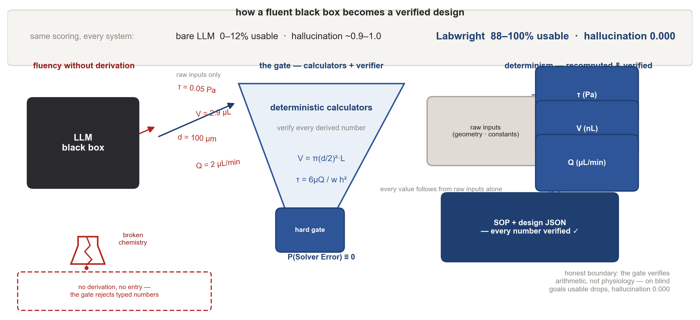
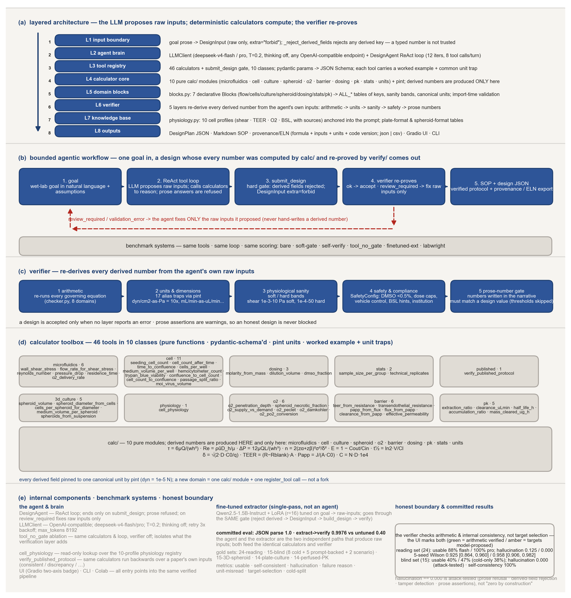
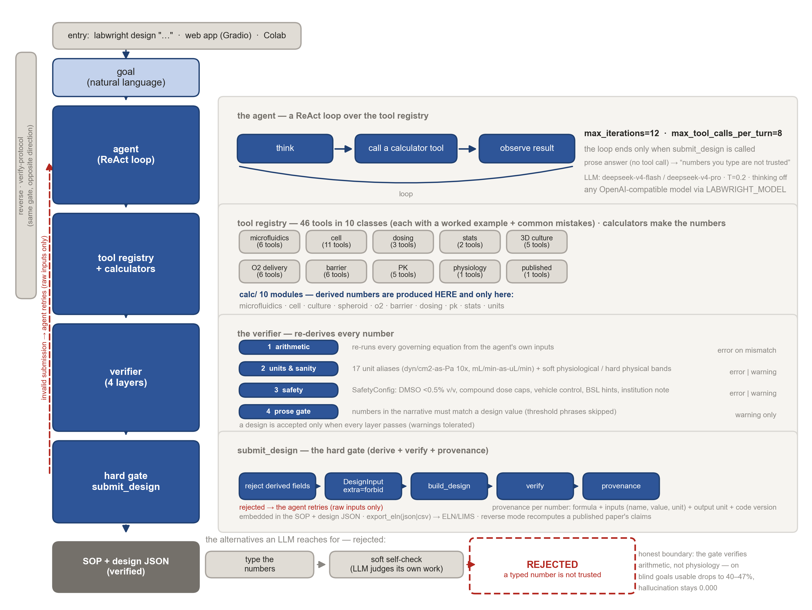
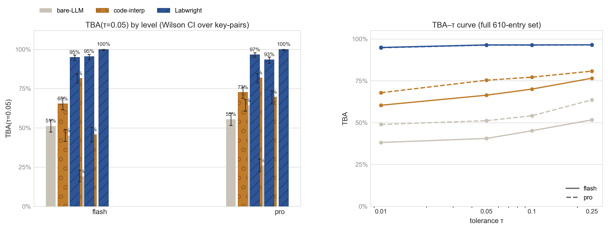
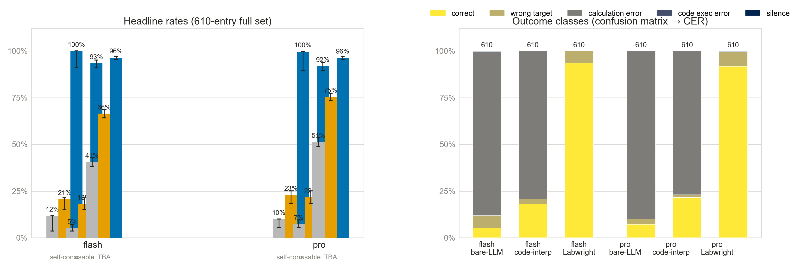
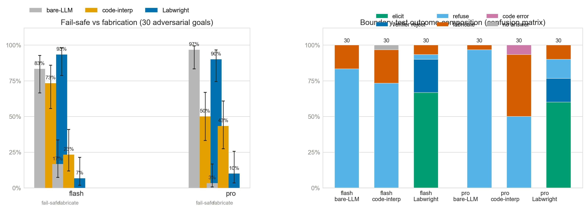
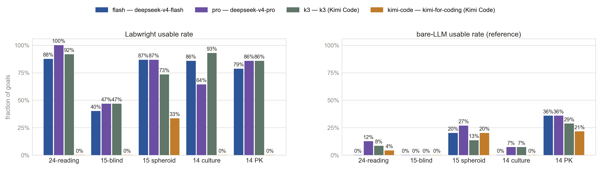

# 🧪 Labwright

**确保你的数字正确无误的AI实验台副驾。**

[](LICENSE)
[]()
[](https://github.com/qgeng1465/labwright/actions)
[]()


当一个大语言模型（LLM）被要求撰写湿实验设计时，它会凭记忆产生数字，而记忆不会做算术。Labwright拒绝让任何数字进入设计，除非它是由确定性计算器算出来的、并且验证器（verifier）重新证明过。这一条规则换来两个独立的性质，而把两者区分开来很重要：

1. **数值一致性有保证。** 每个派生数字（derived number）都从它自己的原始输入（raw inputs）重新推导而来。设计不可能携带计算器没检查过的数字，因此在大多数集合上幻觉（hallucination）率为0.000。
2. **目标选择是尚未解决的问题。** 内部一致性不等于选对了生理学目标。基准测试区分两类目标：*阅读集*（reading set，24个目标陈述了答案，pipeline只需抽取并计算）和*盲测集*（blind set，15个目标不含任何数字，模型必须自己回忆目标值）。在阅读集上可用（usable）率为88–100%；在盲测集上降到40–47%，而在十二个真正“冷”的目标（cold goals，答案既不在目标也不在提示中）上，Labwright 达到7/12 = 58%（95% CI 32–81%），但其中四个是计算器按器官名推导的 scaling 目标（门控路径，非模型记忆），因此八个纯记忆型冷目标仍只有3/8 = 38%。

硬门禁拦得住编造的数字，拦不住错误的目标。这条边界正是项目的核心论断：**验证解决的是数值一致性问题，而不是科学目标选择问题。** 下表即证据；完整协议见 [`eval/`](eval/README.md)。

| 系统 | 派生数字如何产生 | 可用设计（24个阅读目标） | 幻觉 |
|---|---|---|---|
| 裸前沿大模型（现状） | 凭记忆写出 | **0–12%** | ~0.9–1.0 |
| “自查”/LLM充当验证器 | 自我派生（soft-gate、self-verify） | **0%**（设计目标上）；只有少数单步算术目标能达到8–12%，而且第二遍会主动破坏第一遍 | ~0.75–1.0 |
| **Labwright** | 计算器计算；验证器重新证明 | **88–100%** | **0.000** |

*快照：仅含24目标的阅读集；15目标的盲测集和15目标的3D球状体集见下方完整表格。*

*幻觉 = 验证器以错误级别拒绝的方案 `derived` 字段的比例，按目标取平均；未提交任何设计的运行记为1.0（分母 = 每个方案的派生字段数，而非目标数；定义见下文）。Labwright的幻觉率在大多数集合上为 **0.000**；少数非零单元格是静默或单个被拒字段，绝不是编造的数字（各集合详情见Benchmark一节）。*



**首先为器官芯片（organ-on-chip）和灌注细胞培养而构建。设计上通用于一般湿实验。**

👉 **试一试：** `pip install -e .[agent]`（PyPI发布待定）· [在Colab打开](https://colab.research.google.com/github/qgeng1465/labwright/blob/main/colab/labwright_demo.ipynb) · [Web演示](hf_space/) · 反向验证*已发表*的协议：`labwright verify-protocol examples/verify_protocol.json`

**适用人群。**
- *湿实验科学家*：粘贴论文的几何/流量/剪切力，3秒内得到不一致检查结果（`labwright verify-protocol`），或描述一个实验并得到验证过的SOP。
- *AI for Science研究者*：一个硬门禁agent架构，附带可复现的基准测试和诚实陈述的边界（[`eval/`](eval/README.md)）。
- *贡献者*：新增一个领域就是一个文件夹，而不是一次fork（见下文「扩展Labwright」）。

---

## 为什么做这个项目

已发表的生物科学成果有一半以上无法复现（[可复现性危机，约 $28B/年](https://pmc.ncbi.nlm.nih.gov/articles/PMC11537370/)）。一个重要推手：带着错误数字的实验设计——不生理的剪切应力、统计功效不足的重复数、细胞毒性的DMSO浓度——却因为没人检查算术而通过了同行评审。

LLM让情况更糟。当被要求设计一个灌注实验时，前沿模型会自信地写出“剪切应力0.25 Pa”，不管这数字是否由它选定的几何推出。**当数字来自记忆时，它们不是算出来的——而是猜出来的。**

## 当今湿实验LLM尚未填补的缺口

LLM能给你写出漂亮的协议。但其中**每一个数字**——剪切应力、流速、接种密度、DMSO残留、重复数——都是*派生*量：只有在你选定几何、流量、细胞密度之后它才存在。模型凭记忆写这些，而记忆不会做算术。

我们考察了所有能跑起来的相近系统。没有一个能填补这个缺口；Labwright是能填补的那个：

| 系统 | 如何处理协议中的数字 | 能否*证明*一个数字确实由其自身输入推出？ |
|---|---|---|
| **Thoth**（ICLR 2026） | 在12k+ 真实协议上训练的8B模型，带结构化奖励，用于写出*貌似合理*的协议文本 | 否：验证是学来的、模型内部的奖励 |
| **BPL-COGEN**（bioRxiv 2026） | 编译器在300个Nature Protocols上达到95.1% 的*类型*保真 | 否：只检查结构，不检查物理 |
| **ChemCrow**（Nature Mach. Intell.） | 用于化学的LLM agent；验证委托给LLM充当裁判 | 否：裁判的算术不可信 |
| **LLM self-check**（“自查”） | 模型重新派生自己的数字 | 否：我们实测过；第二遍会主动破坏第一遍 |
| **MMFT OoC Designer**（IEEE TCAD 2024） | 确定性的器官芯片*几何*综合 | 无LLM、无自然语言、无细胞/给药/统计层 |
| **Labwright**（本仓库） | LLM提出**原始输入**；确定性计算器计算每个派生数字；验证器**重新推导每一个** | **是：硬门禁（hard gate）。** 任何数字只有被计算器算出、并经验证器重新证明后，才能进入设计 |

**Labwright反转了责任：模型无法打出计算器没检查过的数字——这是硬门禁，而不是软奖励。** *相同的*计算器也反向运行。粘贴一篇已发表论文的几何、流量和声称的剪切力；Labwright重新计算这些声明，并标记任何不能从论文自身输入推出的内容——三秒钟的可复现性检查（[`labwright verify-protocol`](#快速上手)）。

**我们公布了别人没有的衡量标尺。** 上述系统没有一个会衡量自身输出数字是否由自身输入推出；我们会（见上方表格，协议见 [`eval/`](eval/README.md)）。那两套理论上能跑的系统在这里也跑不起来（BPL发布出的pipeline需要约60 GB显存；MMFT是确定性几何综合器，不是LLM），所以我们如实说明，而不声称可以做正面对决。一条诚实的边界：验证是*必要条件，而非充分条件*。Labwright证明数字在内部一致；它无法补充模型不具备的生理学知识。在15目标的盲测集上，可用率从阅读集的88–100% 骤降到 **40–47%**（`flash` 6/15，`pro` 7/15）。扩展到十二个真正**冷**的目标（答案既不在目标也不在提示中）后，两个模型各恢复 **7/12 = 58%**（95% Wilson CI 32–81%），但其中四个是计算器按器官名推导的 scaling 目标（门控路径，非模型记忆），因此八个纯记忆型冷目标仍只恢复 **3/8 = 38%**（14–69%）；另外五个是*提示内答案*（prompt-backed），答案就位于提示里某个区间内。这条边界才是真正的研究前沿，而本项目正致力于缩小它。

## 你能得到什么

| | 没有Labwright | 有Labwright |
|---|---|---|
| “剪切应力” | 凭记忆猜测 | `6·μQ/(w·h²)`，根据你的几何重新计算 |
| “每组n” | 编造 | 根据你的效应量与 σ 做功效分析 |
| DMSO残留 | “可忽略不计” | `working/stock`，若 > 0.5% v/v则标记 |
| 内部一致性 | 不可验证 | 每个派生字段都由验证器重新检查 |
| 剪切力的单位 | 谁读论文谁说了算 | 检测到把dyn/cm² 当作Pa的误读并标记为单位错误（0.2 dyn/cm² ≠ 0.2 Pa） |
| 不可能存在的剪切力 | 放行 | 超出生理区间 → 警告；超出物理极限 → 错误 |
| 细胞毒性剂量 | 放行 | 对照机构的安全边界给出理由并拒绝 |
| “这个数字从哪来的？” | “相信我” | 公式 + 每个输入（名称、数值、单位）+ 代码版本，写入SOP与设计JSON |

## 验证是分层的，安全性可配置

算术只是“数字正确”的第一层。Labwright按顺序检查四层，并且绝不静默放过任何违规：

1. **算术：** 验证器重新运行每一个控制方程（[`labwright/verify/checker.py`](labwright/verify/checker.py)）。
2. **单位与量纲：** 每个字段都有规范单位（[`labwright/verify/units.py`](labwright/verify/units.py)）；别名表能抓住真正咬人的误读（dyn/cm² 对Pa = 10×，mL/min对 µL/min，……）。基准测试的**单位误读率**把这些计为单位错误，而非一般算术错误。
3. **生理范围：** 每个量都落在合理性区间（[`labwright/verify/sanity.py`](labwright/verify/sanity.py)）内：壁面剪切应力0.001–10 Pa（硬区间1e-4–50）、接种密度10³–10⁷ cells/cm²、DMSO <0.5% v/v（硬区间 <14%）。超出软区间给警告；超出硬区间报错误。
4. **安全与合规**（[`labwright/verify/safety.py`](labwright/verify/safety.py)）：危险化合物剂量上限（例如多柔比星 >0.5 mM附理由拒绝）、必须配对的溶剂对照（vehicle control）、针对BSL-2细胞材料的BSL提示、动物伦理提醒，且所有阈值都存在于实验室按机构设定的 `SafetyConfig` 边界中（JSON或代码）：
   ```python
   from labwright.verify.safety import SafetyConfig, set_safety_config
   set_safety_config(SafetyConfig(max_dmso_vv=0.01, institution="C-301"))
   ```

**计算溯源（computation provenance）**（[`labwright/sop/provenance.py`](labwright/sop/provenance.py)）让“由calc计算、由verify验证”成为审稿人可逐行重新推导的事实：SOP中每个加粗数字都携带其公式、每个输入（名称、数值、单位）、输出单位、Labwright代码版本以及验证器的裁决，并附加到SOP、嵌入设计JSON，且可导出到ELN/LIMS（`export_eln(plan, issues, fmt="json"|"csv")`）。Web演示以可点击的溯源面板展示。

**agent被约束在诚实路径上**（[`labwright/agent/agent.py`](labwright/agent/agent.py)）：如果目标纯粹是计算，它必须直接调用计算器而不是写数字；在行动前必须把目标分解为计划；当验证失败时，它**只能修正自己提出的原始输入，绝不为掩盖检查而手写派生数字**。每个工具的描述都带有工作示例和常见错误。

**硬门禁经受了攻击测试：** `hallucination_rate == 0.000` 这些单元格不是“我们说了算的0”；幻觉数字进入设计的每一条替代路径都被关闭，并由对抗性测试套件证明已关闭（[`tests/test_gate_security.py`](tests/test_gate_security.py)）。硬门禁的论断是：只有当一个派生数字由计算器产生并经验证器重新证明后，它才能进入设计；球状体集上一个被拒方案（flash 0.011）和一次不提交的静默（`pro` 0.067）恰恰是硬门禁在*起作用*，而不是失效：

| 攻击 | 防御 | 测试 |
|---|---|---|
| 用散文作答目标（“剪切力是0.25 Pa”） | 拒绝散文式回答；只接受 `submit_design` | `test_prose_only_answer_is_refused` |
| 把 `shear_pa` / `derived{…}` / `culture.seed_per_well` 偷偷塞进 `submit_design` | `submit_design` 对每个派生字段名以校验错误拒绝，绝不静默丢弃 | `test_submit_rejects_*`, `test_agent_recovers_when_derived_field_rejected` |
| 手工编辑/向已完成方案注入派生字段 | 验证器重新运行计算器并标记不一致 | `test_tampered_*` |
| 在方案自身的散文里（`rationale`、`caveats`）断言与计算器矛盾的数字 | 散文数字门禁（[`labwright/verify/prose.py`](labwright/verify/prose.py)）抽取每一个带单位的数字，换算到该字段的单位（因此“0.5 dyn/cm²”按0.05 Pa判定），并在与方案实际携带的任何数值都不匹配时给出警告 | `test_prose_*` |

`*` 表示 `tests/` 中的一族测试；仅列代表性名称（`test_submit_rejects_*` 覆盖 `test_submit_rejects_derived_block`、`test_submit_rejects_top_level_derived_field`、`test_submit_rejects_derived_field_in_culture_block`、`test_submit_rejects_derived_field_in_spheroid_block`；`test_tampered_*` 覆盖 `test_tampered_derived_field_caught_by_verifier`、`test_tampered_spheroid_field_caught_by_verifier`；`test_prose_*` 覆盖散文门禁的正/负用例）。

散文断言只是警告，绝不会报错误，因此诚实的设计永远不会被阻塞；阈值表述（"above 400 µm"、"up to 24 h"）是领域知识而非设计主张，不作判定。

## 演示

```
$ labwright design "liver-chip model of drug-induced injury at sinusoidal shear"
✓ all derived numbers verified against the calculators

# SOP: Model drug-induced liver injury in a perfused liver-chip at sinusoidal shear

## 2. Perfusion
- Flow rate: **2.00 µL/min** per channel
- Wall shear stress: **0.050 Pa** (0.50 dyn/cm²)
- Reynolds number: 0.13 (laminar, Re << 2300)
- Pressure drop: 20.0 Pa; verify the pump can hold this

## 3. Cell seeding
- Seeding density: 100000 cells/cm² over 0.080 cm²
- **Seed 8000 cells** per channel

## 4. Compound dosing
- Working dose: **0.1 mM** (Acetaminophen)
- DMSO carry-over: 0.10% v/v  ✅

## 5. Statistical design
- **16 biological replicates per group** (α=0.05, power=0.80, effect=1σ)
```

模型选择了目标、几何和假设。每个加粗数字都由 `labwright.calc` 计算并通过了 `labwright.verify`。

## 快速上手

```bash
pip install -e .[agent]        # PyPI release pending (name reserved)
export DEEPSEEK_API_KEY=sk-... # any OpenAI-compatible API works
labwright design "lung-on-chip at alveolar-capillary shear (~0.03 Pa)"
```

3秒得到一个验证过的设计。`labwright tools` 列出agent可调用的每个计算器；`labwright design "..." --output sop` 只打印协议。

**对已发表协议做合理性检查：** 设计流程的逆向。给定论文的几何、流量和声称的剪切力/Re/n，Labwright重新计算每个数字，并标记任何不能从论文自身输入推出的数字：

```bash
labwright verify-protocol examples/verify_protocol.json
# shear_pa   computed 0.05  claimed 0.5  rel.err 9.000  discrepancy
# → 1 claimed value(s) do not follow from the reported inputs.
```

**模型。** 默认大脑是 `deepseek-v4-flash`（便宜、关闭思考；算术在计算器里，不在模型里）。任何OpenAI兼容模型都可通过 `LABWRIGHT_MODEL` 使用；`deepseek-v4-flash` 和 `deepseek-v4-pro` 都在 `results/` 里做了基准测试。

**在浏览器里运行，无需安装：**

[](https://colab.research.google.com/github/qgeng1465/labwright/blob/main/colab/labwright_demo.ipynb)
[colab/labwright_demo.ipynb](colab/labwright_demo.ipynb) 会安装Labwright、设计一个灌注式肝脏芯片，并反向验证一个协议的各个数字。

Web演示（Hugging Face Space）：[`hf_space/`](hf_space/)，部署见 [`hf_space/PUBLISH.md`](hf_space/PUBLISH.md)。

**可复现环境。** 钉死的依赖清单是 [`requirements.txt`](requirements.txt)；非 root 容器（[`Dockerfile`](Dockerfile)）构建出完全一致的运行时。一键复现整个基准（生成数据集 → 全量基准 → TBA/消融/对抗分析 → 出图 → 溯源日志 → 测试+审计门）是 [`scripts/reproduce_all.sh`](scripts/reproduce_all.sh)（`FULL=1` 跑全部 610 条 × 模型 × 系统；默认是 5 条冒烟）。

## 工作原理





目标进去；每个数字都由 `labwright.calc` 计算、并由 `labwright.verify` 重新证明的设计出来。agent负责叙述；算术被放逐到经过单元测试的代码里。

- **`calc/`：** 纯的、带单元测试的工程数学——十一个设计领域，每个领域是一个 `calc/` 模块，带各自的schema模型、derive函数和 `Block`（raw/derived键、合理性区间、规范单位）：
  - 四个核心领域：微流控（`calc/microfluidics.py`）、平板细胞培养（`calc/culture.py`，gold为 `eval/gold_cell_culture.json`）、3D培养（`calc/spheroid.py`，gold为 `eval/gold_spheroid.json`）、芯片上药代动力学（`calc/pk.py`，gold为 `eval/gold_pk.json`）；
  - 七个post-v1器官芯片领域：屏障完整性（TEER / Papp / clearance，`calc/barrier.py`）、氧气（Krogh穿透、坏死核，`calc/o2.py`）、重力驱动无泵灌注（摇摆WSS / OSI，`calc/pumpless.py`）、肺部ALI + 呼吸牵拉（`calc/breathing.py`）、脉动/心脏波形（Womersley / OSI / PI，`calc/pulsatile.py`）、多器官异速缩放（`calc/scaling.py`）、源–汇趋化梯度（`calc/gradient.py`）；这些共享一个gold集合（`eval/gold_new_domains.json`）。

  分界线在于：LLM无法可靠地计算这些，但计算器可以。
- **`agent/`：** 在工具注册表之上的ReAct循环。它可以调用任意计算器，且必须以调用 `submit_design` 收尾。散文式回答会被拒绝：*“你打出来的数字不可信。”*
- **`verify/`：** 在agent自己的输入上重新运行每个控制方程，并拒绝不匹配的设计。这正是让“无幻觉数字”的论断可以被检验、而不只是被断言的原因。
- **`extract/`：** 一个微调过的 目标→原始输入 模型（Qwen2.5-1.5B LoRA，`extract/pipeline.py`）。它把自然语言目标直接映射为随后由计算器检查的原始输入，因此无需agent往返也能生成设计。评估（`extract/eval.py`）：JSON解析 **1.0**，extract→verify一致性与字段恢复在一个**无泄漏的留出**400行集 + 15个盲测目标上测量（与训练划分零重叠），对照同一批行上未调优的 `deepseek-v4-flash`/`pro` 基线（`results/extractor/eval_report.json`；评估集位于 `results/extractor_clean400/`）。训练数据是合成的——原始输入在生理区间内采样、派生数字由验证器所用的同一个计算器确定性重算、每个数字都可追溯到来源钉死的gold或盲测DOI——历经四代增长：
  1. **11个领域**（磁盘上54,742行，49,500训练 / 5,242评估）：从两个起步；七个post-v1领域由各自的计算器以相同格式生成。
  2. **`extractor_11dom_v2`**（56,725行，51,300训练 / 5,425评估）：新增**跨领域复合目标**（一个平台上两个子系统，各一个block）和**负样本**（目标里内嵌的 `≈value` 派生主张被翻转为错误值，让模型学会目标文本可能断言一个计算器会反对的数字）。
  3. **`extractor_11dom_v3`**（约49.8k行，含46个gold对）：用手写书面语变体重新生成七个post-v1领域——这正是Benchmark中新领域提升（0/14 → 4/14）背后的修复。
  4. **`extractor_11dom_v4`**（当前；61,043行合成 + 46个gold对，90/10划分 → 54,980训练 / 6,109评估）：向四个核心生成器（flow/culture/spheroid/pk）追加自然语域（手写散文）模板。这就是生产适配器（`lora_v6`）训练所用的划分。

  **表述来源披露。** post-v1 生成器刻意用与 benchmark 目标*相同*的书面语表述方式来写目标。这不是数据泄漏，两条由 `eval/audit_claims.py` 每次机器核验：46 个有监督 gold 对里不包含任何新领域目标、留出的 `extractor_clean400` 集与 `train.jsonl` 在 raw/goal 上零重叠。第三条是**披露而非断言**：合成生成器从 gold 集的 source-pinned DOI 抽样目标*数值*（`synthetic.py`），所以 gold 数值确实会原样出现在训练目标里——盲测 15 条里 11 条带金标值（值+单位匹配），新域生成器同样按设计抽样 gold 值并镜像其表述（由 `eval/audit_claims.py` 复核），下面的基准说明据此把快速通道盲测行标注为 `targets in train`：该行衡量分布内数值回忆，而非未见目标的泛化；真正未见目标泛化的证据由从未训练的 agent 循环承担。镜像表述对快速通道数字的含义在下面的基准说明里如实陈述：新领域分数衡量的是从镜像语域模板吸收 schema 的能力，而非"未见表述"的泛化（针对它的 prompt 级修复也已被证伪——见 [`eval/README.md`](eval/README.md)）。

  一次数据审计还修好了呼吸生成器：牵拉周期现在等于 `1/frequency`（0.2 Hz → 5 s，0.25 Hz → 4 s），因此 `stretch_seconds`/`cycle_seconds` 在物理上一致且能从目标恢复；v2以确定性方式重新生成，完整的验证器审计报告0个错误行（6.4% 抽查）。
- **`schema/` + `published.py`：** 验证过的设计方案类型（`DesignPlan`、`CulturePlan`，……）；`published.py` 把*相同的*计算器反向运行在已发表协议自身的输入上。新增领域就是一个 `calc/` 模块 + 一次 `tools.py` 注册，而不是fork。

## 相关工作与差异化

我们不是第一个把LLM用到湿实验设计上的，我们直说。上面的[对比表](#当今湿实验llm尚未填补的缺口)把Labwright与我们能跑起来的每个相近系统（Thoth、BPL-COGEN、ChemCrow、LLM self-check、MMFT）并列。其中三个定义了这片领域；Labwright的主张更窄、更锐利：**除非确定性计算器算出了某个数字、且验证器重新证明了它，否则任何数字都不能进入设计。** LLM提出原始输入和连贯的生物叙述（它真正擅长的那件事），而每个计算出的值都被放逐到经过单元测试的代码里。这是*硬门禁*，而不是软奖励：

> **Thoth学会写貌似合理的数字。BPL检查它们类型正确。Labwright拒绝物理不支持的数字。**

以上系统都不具备的两个能力：

1. **对已发表协议的反向验证：** `labwright verify-protocol` 读取论文报告的几何、流量和声称的剪切力 / Reynolds / n，从论文*自身*的输入重新计算它们，并标记任何不能推出的数字。这是一个文献合理性检查器，而不只是设计生成器。[`eval/run_verify_batch.py`](eval/run_verify_batch.py) 在一组已发表协议 + 明确标注的合成对照（[`eval/published_protocols/`](eval/published_protocols/)）上运行它。放大到文献规模，`eval/run_scirecipe_audit.py` 在 **21,094** 个真实SciRecipe协议摘要（14,589个含数字 → **5,700个被审计**）上运行了同样的检查。**务必读准分母。** 漏斗收窄三次：

   **5,700个被审计** → **457** 个陈述了派生数字 → **104** 个可从协议自身输入重新推导 → **30** 个内部一致 / **74** 个被论文自身数字反驳。

   - 陈述数字中的可检查率：**104/457 = 22.8%**（**被审计者的1.8%**）；
   - 可检查一致性：**30/104 = 28.8%**。这只是可检查行之间的比率，**不是**“文献中有28.8% 不一致”：在被检查的1.8% 那些说得足够多的协议里，28.8% 与其自身输入一致；
   - 其余 **5,596** 行没有可重新推导的数字（353行陈述了一个但无法复现推导；5,243行没陈述任何数字）；它们被标记为 `unverifiable`，绝不计入“ok”。

   早期一次运行把无派生数字的行计为“ok”，把数字虚增到0.898；这些现在都是 `unverifiable`（一个回归测试钉住了这个修复）。这个漏斗正是 `paper/fig_scirecipe.py` 背后的可复现性差距测量。**这项审计锚定真实文献并单独发布**：每一条被引用的协议标题都解析到验证过的Crossref DOI（3,036个有标题的行中2,376个 = 78.3%，字符串匹配 ≥ 0.90；每条记录都带自身的匹配质量；在验证过DOI的行中，可检查子集为42，其中9个内部一致 = 21.4%）。完整审计（裁决、声称vs计算出的数字、引用的标题、DOI溯源）以 [`qgeng1465/scirecipe-audit`](https://huggingface.co/datasets/qgeng1465/scirecipe-audit) 发布（CC-BY-4.0）。
2. **一个带可复现性标尺的基准测试：** `eval/` 同时测量参数恢复率*和*验证器判定失败的派生数字比例（见下文）。

## 扩展Labwright

添加一个计算器就是整个集成故事：

```python
# 1. write the math in labwright/calc
# 2. declare it in labwright/tools.py
@register_tool(MyParams, "my_calculator", "what it does", my_calc, "my_domain")
```

agent、验证器和演示都读取同一个注册表；新计算器立即可调用、可验证、可演示。

添加一个完整的*设计领域*（设计的一个新可选部分，如3D球状体方案）同样只是一次声明：一个 `calc/` 模块、一个schema模型、一个derive函数，以及 `labwright/blocks.py` 里的一个 `Block`；这一个条目拥有该领域的raw/derived/consistency键、字段映射、合理性区间和规范单位，而设计门禁、验证器、单位层和基准测试都从它导入。忘记区间或单位的领域会在导入时报错失败。完整的第三方契约——calc 模块 → `Tool` → `Block` → 验证器 → gold 条目，端到端，含一个工作示例——见 [`docs/PLUGINS.md`](docs/PLUGINS.md)。规则与开发命令见英文 README 的
「Extending Labwright」节。

## 基准测试

LLM能不能在写湿实验设计时不编造数字？我们来测量。`eval/` 在六个gold集合上对比三个记忆基线与Labwright门禁的两种前端。基线是**裸LLM**（模型凭记忆写每个数字）和两个朴素修复（**soft-gate**、**self-verify**）。Labwright以两种形态出现：**agent循环**（deepseek-v4-flash/pro 通过ReAct工具循环提出原始输入；计算器计算、验证器重新证明）与**快速通道**（一个固定的本地Qwen2.5-1.5B LoRA微调抽取器把目标散文直接变成原始输入）。两种前端共用同一套计算器、同一个验证器和同一道硬门禁——快速通道只是替换了LLM的抽取步骤（无agent循环、无API成本）：

1. **24个“阅读”目标**（`eval/gold_experiments.json`）：每个目标都陈述了答案（几何、流量或生理目标数字）。这测试pipeline能否抽取所述数字并把计算器驱动到它们。它刻意*不*测试领域知识。
2. **15个“盲测”目标**（`eval/gold_blind.json`）：目标不含任何数字（“重现生理性的小静脉壁面剪切力”）；模型必须自己提供规范目标值。八个是 `cold`（答案哪里都没有：肾PTEC、动脉、HepG2接种、PHH接种、肺动脉、肠道、视网膜小动脉、24孔板培养基体积）；五个是 `prompt-backed`（肝、小静脉、肺、BBB、淋巴；答案位于系统提示里的一个区间内；模型仍必须选对值，且以落在区间内为判据，因此小静脉和淋巴也计为提示内）；两个是**仅场景**（量级已陈述，所以它们测试的是失败模式，而非冷回忆）：
   - **单位歧义：** 目标以dyn/cm² 给出并要求换算成Pa；把dyn当成Pa的误读恰好差10×。
   - **多目标：** 两个目标（剪切力1.0 Pa *且*滞留时间 ≥6 s）在一个400×100 µm × 100 mm通道里在Q ≈ 40 µL/min处可同时满足；模型必须同时命中两者。
   每条都钉住一个可引用的来源；没有任何数字是编造的。
3. **15个“3D球状体”目标**（`eval/gold_spheroid.json`）：第三个领域：3D培养（球状体/类器官）。四个是阅读（实心球几何、按尺寸的细胞数），三个演练标准培养器皿的工作体积（96-ULA 100 µL、384-ULA 50 µL、悬滴），四个是失败模式场景（**单位歧义** mm-对-µm、**生长**预测、**多目标** 总细胞 + 总培养基、**跨领域** 球状体 + DMSO给药），四个是盲测（两个 `prompt-backed`：1000 cells/spheroid和96-ULA体积位于系统提示锚点里；两个 `cold`：384-ULA和悬滴体积在提示里哪里都没有）。3D培养对LLM来说是一个刻意设置的知识薄弱区：球状体惯例在不同ULA/悬滴厂商之间支离破碎，所以这一集合考验的是回忆和跨领域推理，而非单一几何。每条都钉住一个可引用的来源或自洽的推导；没有任何数字是编造的。
4. **14个平板培养目标**（`eval/gold_cell_culture.json`）：第四个领域：2D/平板培养（孔、接种密度、计数、活力、汇合度）。十个是阅读（平板几何/密度已陈述），四个是盲测-`cold`（模型必须回忆钉死的PHH三明治接种密度或某个平板表格工作体积）。这一集合的存在是为了证明领域迁移不是微流控计算器的伪影：平板培养计算器是一个独立模块，而盲测 `cold` 单元格需要回忆，而非推导。
5. **14个灌注系统PK目标**（`eval/gold_pk.json`）：第五个领域：芯片上单室药代动力学（提取率、清除率、半衰期、稳态蓄积、清除的质量）。十二个是阅读/场景（每个输入都已陈述，或给出公式的原始数字，含两个**单位陷阱**：mM-对-µM和 分钟-对-小时），两个是盲测 `prompt-backed`（普萘洛尔高提取 / 安替比林低提取；分类在系统提示中陈述，目标数字不在）。PK方程钉在Rowland & Tozer和Gibaldi & Perrier上；一处文献引用指向Baudoin等（doi:10.1002/jps.23796）。
6. **14个post-v1器官芯片目标**（`eval/gold_new_domains.json`）：微流控/培养/球状体/PK之外的七个更多领域——屏障完整性（TEER / Papp / clearance）、溶解pO2（Krogh穿透深度、坏死核）、重力驱动无泵灌注（摇摆WSS、OSI）、肺部ALI + 呼吸牵拉（每分钟呼吸次数、应变率、ALI液膜）、脉动/心脏波形（Womersley数、OSI、PI）、多器官异速缩放（器官流量分数、按质量比例的细胞数）、趋化梯度（陡度、弛豫时间）。全部14个都是完整信息（每个原始值都已陈述），因此这一集合隔离了新的计算器和Block能否端到端集成；每个期望值都由 `eval/make_gold_new_domains.py` 中的真实计算器重新推导，每条都钉住一个可引用的来源。

三个记忆基线与两种Labwright前端在两个前沿模型上对比。记忆系统（bare-LLM、soft-gate、self-verify）凭记忆写数字，用*完全相同*的规则打分；只有提示/阶段结构不同。Labwright增加了计算器和验证器。它的**快速通道**行（标记为**Labwright fast-path**）不是对手系统：它是把LLM抽取步骤替换成本地Qwen2.5-1.5B-Instruct LoRA的Labwright，该LoRA在覆盖全部11个领域的约61k个合成目标（外加46个来源钉死的gold对）上微调，四个核心生成器追加了自然语域散文变体。那些原始输入与agent循环的 `submit_design` 跨过*完全相同*的门禁——计算器推导、验证器重新证明、被拒的设计回来重新抽取。它的柱状在flash和pro下按构造完全相同（固定的本地模型）。与agent循环行并排读，模式就是架构在干它该干的活：在分布内表述上快速通道更强也更便宜；在从未见过的表述上它更弱，而在盲测集上诚实的读法是**数值回忆而非未见生理学**——生成器复用 gold 目标值，15 条盲测里 11 条的目标值也出现在它的训练目标中（见 `eval/audit_claims.py`），且 4 条恢复里 3 条落在这类目标上（BBB 1.0 Pa、肾PTEC 0.02 Pa、BBB-residence 1.0 Pa），只有 `blind-24well-medium-partial`（4.08 mL）是真正未见值的恢复；从未训练的 agent 循环（40–47%）才是未见目标回忆的证据。诚实的提醒：阅读集和平板培养列仍然高估了泛化：24/24个阅读目标和8/14个平板培养gold目标出现在gold对监督中（46个配对 = 24阅读 + 8球状体 + 8培养 + 6药代；盲测与新领域刻意没有配对），因此这些行衡量的是记忆而非迁移；在没有配对的目标上，恢复率是球状体3/7、培养1/6、药代2/8、盲测4/15、新领域4/14（带schema修复则5/14）。

**新的失败模式指标。** 每条还会被分类*为什么*失败（`ok` / `silence` / `calculation_error` / `wrong_target`）、错误数字是否可能是**单位误读**（dyn/cm²-对-Pa等，经由单位层）、标题目标是否在 ±5% 内被**选中**，盲测集单元格按提示强度拆分（cold对prompt-backed）。`eval.report` 渲染器打印所有这些；分类和误读逻辑有单元测试（`tests/test_metrics.py`）。


*可用*设计是内部一致**并且**在 ±5% 内命中每个目标。这是一个*消融实验*，而不是等资源竞赛：Labwright的迭代预算、工具和锚定提示是被测试的处理；唯一偏向bare的不对称是 ±5% 容差和3次重试。完整协议、公平性说明和逐条记录：[`eval/README.md`](eval/README.md)。

```
$ python -m eval.report results/eval_flash.json

metric                          bare-LLM     Labwright
------------------------------------------------------
self-consistent rate                  0%           88%
usable rate                           0%           88%
hallucination rate                 1.000         0.125
```

\*Labwright非零的幻觉单元格（0.125）是**静默，而非编造**：它漏掉的三个阅读集目标是纯计算目标（Reynolds检查、压降目标、功效分析），agent在这些目标上**没有产出设计**（`plan: false`）；不提交的运行按约定计1.0，因此3/24 → 0.125。它从没写过计算器没检查过的数字。*

*定义：**self-consistent（自洽）** = 每个提交的数字都从自身原始输入重新推导（零验证器错误）；**usable（可用）** = 自洽**并且**每个生理目标在 ±5% 内；**hallucination（幻觉）** = 验证器以错误级别拒绝的方案 `derived` 字段比例，按目标取平均（未提交设计的运行计1.0）。幻觉的分母是每个方案的派生字段数，而非目标数；一个带单个被拒字段的目标会把集合级数字移动1/(goals × fields)，所以计0.000的目标不会把集合拉到0.000，而验证器标记的原始输入荒谬值（例如不物理的倍增时间）会使方案无效却不移动幻觉；两个信号必须一起读。方案可以完全自洽却仍然错过目标；这正是15个盲测行所显示的（100% 自洽，40–47% 可用）。*

| 集合 | 模型 | 系统 | 自洽 | 可用 | 幻觉 |
|---|---|---|---|---|---|
| 24-reading | `flash` | bare-LLM | 0% | 0% | 1.000 |
| 24-reading | `flash` | soft-gate | 12% | 12% | 0.875 |
| 24-reading | `flash` | self-verify | 0% | 0% | 0.792 |
| 24-reading | `flash` | **Labwright** | **88%** | **88%** | **0.125** |
| 24-reading | `flash` | Labwright fast-path (24/24 seen) | 100% | 96% | 0.000 |
| 24-reading | `pro` | bare-LLM | 12% | 12% | 0.875 |
| 24-reading | `pro` | soft-gate | 8% | 8% | 0.917 |
| 24-reading | `pro` | self-verify | 0% | 0% | 0.750 |
| 24-reading | `pro` | **Labwright** | **100%** | **100%** | **0.000** |
| 24-reading | `pro` | Labwright fast-path (24/24 seen) | 100% | 96% | 0.000 |
| 15-blind | `flash` | bare-LLM | 7% | 0% | 0.933 |
| 15-blind | `flash` | soft-gate | 13% | 0% | 0.867 |
| 15-blind | `flash` | self-verify | 0% | 0% | 0.611 |
| 15-blind | `flash` | **Labwright** | **100%** | **40%** | **0.000** |
| 15-blind | `flash` | Labwright fast-path (targets in train) | 100% | 27% | 0.000 |
| 15-blind | `pro` | bare-LLM | 7% | 0% | 0.933 |
| 15-blind | `pro` | soft-gate | 13% | 0% | 0.867 |
| 15-blind | `pro` | self-verify | 0% | 0% | 0.733 |
| 15-blind | `pro` | **Labwright** | **100%** | **47%** | **0.000** |
| 15-blind | `pro` | Labwright fast-path (targets in train) | 100% | 27% | 0.000 |
| 15-3D-spheroid | `flash` | bare-LLM | 20% | 20% | 0.800 |
| 15-3D-spheroid | `flash` | soft-gate | 13% | 13% | 0.867 |
| 15-3D-spheroid | `flash` | self-verify | 20% | 20% | 0.569 |
| 15-3D-spheroid | `flash` | **Labwright** | **93%** | **87%** | **0.011** |
| 15-3D-spheroid | `flash` | Labwright fast-path (8/15 seen) | 87% | 73% | 0.133 |
| 15-3D-spheroid | `pro` | bare-LLM | 27% | 27% | 0.733 |
| 15-3D-spheroid | `pro` | soft-gate | 27% | 27% | 0.733 |
| 15-3D-spheroid | `pro` | self-verify | 40% | 20% | 0.400 |
| 15-3D-spheroid | `pro` | **Labwright** | **93%** | **87%** | **0.067** |
| 15-3D-spheroid | `pro` | Labwright fast-path (8/15 seen) | 87% | 73% | 0.133 |
| 14-plate-culture | `flash` | bare-LLM | 0% | 0% | 0.893 |
| 14-plate-culture | `flash` | soft-gate | 0% | 0% | 0.893 |
| 14-plate-culture | `flash` | self-verify | 0% | 0% | 0.929 |
| 14-plate-culture | `flash` | **Labwright** | **93%** | **86%** | **0.071** |
| 14-plate-culture | `flash` | Labwright fast-path (8/14 seen) | 86% | 57% | 0.143 |
| 14-plate-culture | `pro` | bare-LLM | 7% | 7% | 0.750 |
| 14-plate-culture | `pro` | soft-gate | 7% | 7% | 0.786 |
| 14-plate-culture | `pro` | self-verify | 0% | 0% | 0.821 |
| 14-plate-culture | `pro` | **Labwright** | **86%** | **64%** | **0.043** |
| 14-plate-culture | `pro` | Labwright fast-path (8/14 seen) | 86% | 57% | 0.143 |
| 14-perfused-PK | `flash` | bare-LLM | 50% | 36% | 0.500 |
| 14-perfused-PK | `flash` | soft-gate | 50% | 50% | 0.500 |
| 14-perfused-PK | `flash` | self-verify | 79% | 29% | 0.214 |
| 14-perfused-PK | `flash` | **Labwright** | **100%** | **79%** | **0.000** |
| 14-perfused-PK | `flash` | Labwright fast-path (6/14 seen) | 50% | 50% | 0.500 |
| 14-perfused-PK | `pro` | bare-LLM | 43% | 36% | 0.536 |
| 14-perfused-PK | `pro` | soft-gate | 50% | 36% | 0.500 |
| 14-perfused-PK | `pro` | self-verify | 79% | 29% | 0.214 |
| 14-perfused-PK | `pro` | **Labwright** | **100%** | **86%** | **0.000** |
| 14-perfused-PK | `pro` | Labwright fast-path (6/14 seen) | 50% | 50% | 0.500 |

*所有记忆系统行都来自温度0.2下的单次重跑——在发现并修复了一个把目标文本弄丢的提示回归之后（见 [`eval/README.md`](eval/README.md) 中的透明度说明）；Labwright行是已提交的运行，逐字保留；Labwright的agent始终收到目标，因此这个bug从未触及它。15-3D球状体记忆系统行还因打分器的公平性修复而重跑：字符串培养器皿格式（`spheroid_format` / `plate_format`）以前从未从记忆系统输出中抽取，因此每个球状体惯例目标都计1.0不可验证，无论答案如何；修复恢复了它们，从所需的原始值重新计算每个派生数字，并排除已报告但不可重算的数字。之前提交的0% / 1.000球状体单元格正是这个伪影。修复后，唯一可用的记忆系统条目是24-阅读集上三个单步算术目标（`pro` bare / `flash` soft-gate为12%）外加少量单步球状体几何/查询目标（bare 20% / 27%，`flash`/`pro`）。记忆系统之间一两个百分点是采样噪声；定性排序（Labwright ≫ 记忆系统）不是。为什么相关工作里已发表的那些系统没有在这里做基准测试，详见 [`eval/README.md`](eval/README.md#benchmarking-scope-why-these-systems-and-not-the-named-ones)。*

诚实地读这些数字，以及它们含义的边界。

### LabMath-Bench：610 个生成问答对上的容差边界准确率

审稿意见要求一个把*算术*和*生理*分开打分的基准。`eval/gold_labmath_combined.json` 就是它：**610 个设计问句**，横跨五个新计算器域（生物打印、共培养、酶动力学、生信流程参数化、溶剂处理），按难度分成三级——**L1** 流体与空间工程（**213**）、**L2** 生化配比（**223**）、**L3** 流程参数化（**174**）。每条都用合法参数区间抽样生成，期望值由 agent 调用的*同一个确定性计算器*算出，因此每条自洽、数字全部可追溯（`eval/make_labmath_bench.py`，确定性种子；五个新 `calc/` 模块和注册表里其他模块一样 source-pinned）。

头条指标就是审稿人的公式 **TBA**——容差边界准确率：

$$\mathrm{TBA}(\tau) = \frac{1}{N}\sum_{(e,k)} \mathbb{I}\!\left(\frac{|y_{pred} - y_{true}|}{y_{true}} \le \tau\right)$$

在严格 `τ = 0.05` 下报告，对每个已打分的 (条目, 金标准目标) key-pair 求平均，并按等级分组给出 Wilson 95% CI（`eval/report.py`；`paper/fig_tba.py`）。

| 模型 | 系统 | usable | 幻觉率 | TBA(0.05) | 计算错率（CER） |
|---|---|---|---|---|---|
| `flash` | bare-LLM | 5% | 0.765 | 0.406 | 536/610（88%） |
| `flash` | code-interp | 18% | 0.602 | 0.664 | 484/610（79%） |
| `flash` | **Labwright** | **93%** | **0.000** | **0.965** | **0/610（0%）** |
| `pro` | bare-LLM | 7% | 0.735 | 0.512 | 549/610（90%） |
| `pro` | code-interp | 22% | 0.579 | 0.754 | 470/610（77%） |
| `pro` | **Labwright** | **92%** | **0.003** | **0.963** | **0/610（0%）** |

TBA(0.05) 分等级，Wilson CI 基于打分 key-pair：

| 等级 | 模型 | bare-LLM | code-interp | Labwright |
|---|---|---|---|---|
| L1 | `flash` | 51% [47–55] | 65% [62–69] | **95% [93–96]** |
| L1 | `pro` | 55% [52–59] | 73% [69–76] | **97% [95–98]** |
| L2 | `flash` | 45% [41–49] | 82% [78–84] | **96% [94–97]** |
| L2 | `pro` | 64% [61–68] | 82% [79–85] | **94% [91–95]** |
| L3 | `flash` | 19% [16–23] | 46% [41–50] | **100% [99–100]** |
| L3 | `pro` | 26% [22–30] | 70% [65–74] | **100% [99–100]** |

CER 列背后的混淆矩阵——每条都分类*为什么*失败（`ok` / `silence` / `calculation_error` / `code_exec_error` / `wrong_target`），所以审稿人要的 **CER→0** 是直接可审计的计数：

| 模型 | 系统 | ok | silence | 计算错 | 代码执行错 | 目标错 |
|---|---|---|---|---|---|---|
| `flash` | bare-LLM | 31 | 2 | **536** | 0 | 41 |
| `flash` | code-interp | 110 | 0 | **484** | 0 | 16 |
| `flash` | **Labwright** | **570** | 0 | **0** | 0 | 40 |
| `pro` | bare-LLM | 44 | 0 | **549** | 0 | 17 |
| `pro` | code-interp | 132 | 0 | **470** | 0 | 8 |
| `pro` | **Labwright** | **560** | 2 | **0** | 0 | 48 |

诚实的读法正是审稿人要的。基线 A（bare-LLM）在 88–90% 的条目上犯了计算错：模型凭记忆写数字，算术是错的。基线 B（LLM + 代码解释器，`code_interpreter`）执行模型*自己*写的 Python 来算 `RESULT`，有帮助（TBA 0.664/0.754，计算错降到 79%/77%），但无法消除算术错——代码同样来自记忆，照样算错。只有 Labwright，其算术活在确定性、source-pinned 的计算器里、由重新证明的验证器把关，才能把 **CER 打到 0**、TBA(0.05) 打到 0.965/0.963。而且 Labwright 的 miss 恰恰是**参数提取失败**（`wrong_target`，剩余 40/48 条）——绝不是计算错。该归因给 NLU 提取的残余，不属于数学。pro 的 2 条 Labwright `silence` 是未提交运行，按和其他集合一致的约定计 1.0。





### 对抗输入下的 fail-safe

第二条对抗轴（`eval/gold_adversarial.json`，30 条输入）逼到边界：**缺参数**（少了必需的输入）、**物理冲突**（目标给出不可能的几何/体积）、**致死条件**（目标隐含细胞死亡的剪切/流速）。`request_info` 工具让 Labwright agent 在猜之前*先问*，验证器硬拒不可能的方案。每条运行用四个诚实数字打分（30 条平均；`paper/fig_failsafe.py`）：

| 模型 | 系统 | 主动提问 | 异常拦截 | fail-safe | 捏造 |
|---|---|---|---|---|---|
| `flash` | bare-LLM | 0% | 0% | 83% | 17% |
| `flash` | code-interp | 0% | 0% | 73% | 23% |
| `flash` | **Labwright** | **67%** | **23%** | **93%** | **7%** |
| `pro` | bare-LLM | 0% | 0% | 97% | 3% |
| `pro` | code-interp | 0% | 0% | 50% | **43%** |
| `pro` | **Labwright** | **60%** | **17%** | **90%** | **10%** |

诚实的边界：bare-LLM 的"fail-safe"是*不带信息的拒绝*——它拒答而不是捏造（flash），或大部分拒答（pro），但从不提问，所以缺参数直接卡死任务（两个模型主动提问都是 0%）。pro 上的代码解释器基线是**最差的捏造者（43%）**：给了"去算"的指令，它就算得信心满满，哪怕对致死/缺参数输入也写出数字。Labwright 在 60–67% 的缺参数输入上主动提问，其余靠验证器硬拒（异常拦截 17–23%），捏造率控制在 ≤ 10%——那点没提问就作答的残余诚实报告为余量。门是 fail-safe 的，不是万无一失的。



### 新领域集成：七个post-v1器官芯片领域

七个post-v1领域（barrier、oxygen、pumpless、breathing、pulsatile、scaling、gradient）在14个新领域目标上用 **Labwright** 系统做了端到端基准测试——完整的agent循环、计算器和硬门禁，跑在实时模型上：

| 集合 | 模型 | 系统 | 可用 | 幻觉 |
|---|---|---|---|---|
| 14-new-domains | `flash` | **Labwright** | **13/14 (93%)** | **0.071** |
| 14-new-domains | `pro` | **Labwright** | **11/14 (79%)** | **0.214** |
| 14-new-domains | `flash` | Labwright fast-path | 4/14 (29%) | 0.512 |
| 14-new-domains | `pro` | Labwright fast-path | 4/14 (29%) | 0.512 |

每个提交的设计都以机器精度恢复每个gold目标，且**在已提交的设计中，两个模型的幻觉率都是0.000**。非零的幻觉条目正是*静默*行——agent在这些目标上耗尽了完整的12个工具预算却从不提交。打分器把缺失方案计为幻觉1.0（什么都不能信），因此flash的0.071 = 它的一个静默行，pro的0.214 = 它的三个。诚实的边界：**gradient-fgf8-pattern** 目标在两个模型上都以*静默*告终，而 `gradient-cxcl12-chemotaxis` 只在 `pro` 上如此——`flash` 以机器精度恢复了cxcl12源–汇——硬门禁守住了，没有任何编造通过。`pro` 还在 `pumpless-hepg2-rocking` 上超时（`flash` 解决了它）——这是模型不稳定，而非领域缺口。记忆系统行没有在这些目标上重跑；这一集合测量的是新Block能否集成，而非消融排序。

- **“0.000幻觉”是架构保证，而非实测战绩。** Labwright的派生数字来自计算器，而验证器用*相同的*计算器重新计算它们，因此已提交的设计总能通过验证。这个数字实际说的是：**任何数字只有被计算器产生、并经验证器重新证明后，才能进入设计。** 这就是全部主张，而且是很强的主张。它并**不**是说“每个设计在生理上都正确”。
- **24-阅读集上恢复率 ≈ 0是构造使然**：目标直接把答案交出来，自洽锚点由同一组方程算出。那里真正的信号是数字抽取和工具调用，一种真实能力（bare只在三个单步算术目标上达到可用 > 0，且只有12%；在每一个需要选择几何和流量的目标上，两个模型都是0%）。
- **两个朴素修复都不管用。** `soft-gate`（一个“再自查一遍”的提示）偶尔能完成一个单步算术目标，但从未救回一个设计；被叮嘱小心并不会让LLM的算术可检查。`self-verify`（用第二次LLM通过充当自己的验证器）比什么都不做*更糟*：拿到自己的原始输入后，模型把它们重算错了，于是验证通过把正确数字覆盖成自信的错误数字；在两个集合、两个模型上都是0% 自洽。只有确定性计算器 + 验证器能在设计目标上达到可用 > 0%。
- **盲测集才是真正测试目标选择的地方，而Labwright在这里跌落。** `flash` 88% → 40%，`pro` 100% → 47%。硬门禁守住了：每个方案都经过内部验证，幻觉率0.000。但设计瞄准了错误的生理学。在这15个目标上：
  - `flash` 恢复 **6/15**：动脉1.5 Pa、HepG2接种、24孔板培养基体积、肺0.03 Pa，以及两个场景目标（dyn/cm²-当作-Pa单位测试和剪切力 + 滞留时间联合目标）。
  - `pro` 恢复 **7/15**：动脉、HepG2接种、24孔板培养基、小静脉0.3 Pa、肺0.03 Pa、BBB 1.0 Pa，以及单位歧义目标。（`pro` 的多目标运行命中剪切力但滞留时间差了0.5×，因此**不**计为可用。）
  两个可用率都是误差棒很大的单次点估计：6/15 = 40% 附近的95% Wilson CI是 **20–64%**，7/15 = 47% 附近是 **25–70%**；n=15太薄，无法区分两个模型，也无法把任一模型与下面冷目标仅38% 区分开。
  **仅冷目标诚实性检查：** 15个目标中有五个是 `prompt-backed`（答案位于系统提示的生理锚点区间内：肝、肺、BBB、小静脉、淋巴），因此盲测头条高估了真正冷目标上的回忆。2026-08-16 的扩展（`eval/gold_cold_expansion.json`）新增四个冷器官流量目标（脑、心、肠、皮占心输出量的分数，Ucciferri et al. 2014），把冷集合扩到十二个。在全部十二个上 `flash` 和 `pro` 各自恢复 **7/12 = 58%**、95% Wilson CI **32–81%**，但四个新目标是计算器按器官名推导的 scaling 目标（门控路径，非模型记忆），因此八个纯记忆型冷目标上两个模型仍停在 **3/8 = 38%**、95% Wilson CI **14–69%**；n=12仍然太薄无法区分模型，冷回忆远未接近阅读集。无门禁基线的 value-recall（十二个上，每个恢复值在 ±5% 内、无幻觉门禁）是 `flash` **4/12 = 33%**（**14–61%**）、`pro` **3/12 = 25%**（**9–53%**），微调读抽取器是 **1/12**（唯一一次真正未见值的恢复：24孔板培养基；scaling 目标 0/4，因为那需要推导而非抽取）。在那些看似领域知识的恢复中，只有纯记忆型三个真正是冷的；其余（肺、BBB、小静脉）位于提示区间内。去掉两个仅场景目标（它们陈述了量级，因此测试的是失败模式而非回忆），*领域*目标恢复率为 `flash` **4/13 = 31%**、`pro` **6/13 = 46%**；场景目标不应混入冷回忆。
  **提示内答案不意味着已恢复：** 锚点是刻意很宽的区间（例如肝0.05–0.15 Pa），而可用设计必须落在确切惯例值的 ±5% 内，因此即便有提示，选了区间错误一端的模型也会失败；两个模型都把肝提议为0.10 Pa（在区间内，但离0.05 Pa惯例差100%），且都没恢复淋巴。两者都漏掉肾（`flash` 0.50 Pa，离0.02 Pa目标差25×；`pro` 0.05 Pa，差2.5×）和原代肝细胞接种密度（差0.33×）。**硬门禁拦得住编造的数字；它无法补充模型不具备的领域知识。** 这条边界就是诚实的头条，也正是湿实验用户绝不能忘记的：验证目标，而不只是算术。
- **3D球状体集展示了计算器本身承载领域惯例。** 两个模型都落在同一表格行上，自洽 **93%** / 可用 **87%**（13/15），幻觉率 **0.011**（`flash`）/ **0.067**（`pro`），尽管3D培养对LLM是知识薄弱区，仍贴近阅读集上限。两个冷条目（384-ULA 50 µL、悬滴20 µL）被Labwright在两个模型上以 **100%** 恢复，而bare模型为0%，因为这些体积只存在一次于 `SPHEROID_FORMATS`（工具注册表）里，而不在模型记忆中；“计算器即知识库”的主张被具象化了。每个模型的两个失败是诚实的残留，而它们各自正是集合级幻觉非零的原因：
  - 两个模型都错标跨领域多柔比星目标（24和54个球状体对gold 96个），内部一致，*那个目标上* `hall 0.000`（是目标未命中，而非编造数字；硬门禁拒绝了设计），因此它对集合级幻觉贡献0；
  - `flash` 还额外失败于盲测肝细胞形成目标：它恢复了1000 cells/spheroid目标，但方案六个派生球状体字段中的一个被验证器的生理范围层拒绝，因此该目标计 **1/6 ≈ 0.167**；flash整个集合级 **0.011** 就只是这一个目标（0.167 ÷ 15）；
  - `pro` 在单行球体体积目标上返回静默；完全没有设计，计 **1.0**，这就是pro整个集合级 **0.067**（1.0 ÷ 15）。
  单次点估计；n=15时模型对之间的差异是噪声。
- **平板培养集是每个记忆系统都塌到 ~0% 的地方。** 三个朴素系统在两个模型上都落在0% 可用（self-verify `flash` 幻觉 **0.929**；它几乎在每个目标上都把正确数字覆盖成自信的错误数字），而Labwright守住 **86%**（`flash`）/ **64%**（`pro`）。这是基准测试中*最严格*的交叉检查：每个培养答案都由plate_format + 接种密度 + 孔重新推导，而目标没要求的多出的一个字段就会让整个条目不可验证。4个盲测-`cold` 回忆单元格（PHH三明治密度、平板表格体积）正是bare失败的地方；这些数字住在 `CULTURE_*` 表里，而非模型记忆。Labwright在这个集合上自己的非零单元格是硬门禁在抓自己的错误，而非门禁失效：`flash` **0.071** 是一次静默（严格的细胞计数板目标 `plate-hemocytometer-seed-96well` 没有产出设计，hall 1.0），`pro` **0.043** 是两个目标（`plate-96well-total-medium`、盲测-`cold` 的 `blind-96well-area-and-medium`），验证器在这些目标上拒绝了一或两个派生字段（计算错误）；被拒的是字段，绝不是编造的数字。
- **灌注PK集是算术上的升级。** Labwright自洽 **100%** / 可用 **79%**（`flash`）和 **86%**（`pro`），幻觉率 **0.000**。对朴素系统来说PK是个*好*消息：因为大多数目标直接交付公式的原始数字，soft-gate达到 **50%** 可用、self-verify **29%**，正是那些系统偶尔能成功的单步算术。Labwright剩余的缺口是两个盲测 `prompt-backed` 的普萘洛尔/安替比林目标（E = 0.8和0.1位于提示的分类区间内，但确切数字不在），外加一个单位陷阱条目，单位层在mM→µM换算进入方案前就抓住了它。两个真正的**单位陷阱**（mM-对-µM和min-对-h）都被Labwright在两个模型上干净地恢复。
- **Labwright快速通道——同一门禁的微调抽取器前端（lora_v6，multi-block，覆盖全部11个领域的约61k个合成目标；flow/culture/spheroid/pk生成器追加了自然语域散文变体）——在见过表述的地方很强，并且对它意味着什么很诚实。** 阅读：可用 **96%** / 自洽 **100%** / **0.000**——但**这24个目标全部有gold对监督**（46个配对 = 24阅读 + 8球状体 + 8培养 + 6药代；盲测与新领域刻意没有配对），因此这一列衡量的是记忆多于迁移；lora_v5回归过的那个目标（400×100剪切目标）**已恢复**，剩下的唯一未命中（一个*见过*的滞留时间目标）本来就在失败。球状体：**73%** 可用（高于v5的67%）——8/15个gold有配对监督（8个全部恢复，含spheroid-growth-72h目标），真正未见的7个里恢复3个。平板培养：**57%** 可用——一处回归（plate-12well-seed-hepg2，一个*见过*的目标）比v5的64% 少一分；8个有配对的目标恢复7个，6个真正未见的目标恢复1个。PK：**50%** 可用——6/14有配对监督（恢复5个；pk-accumulation-ratio已恢复而pk-half-life回归），8个真正未见的目标恢复2个。盲测：**27%** 可用 / **100%** 自洽（幻觉 **0.000**，高于v5的93% / 0.067），4/15恢复——但这是分布内数值回忆：生成器复用gold目标值，11/15条盲测目标值也出现在训练目标里，4条恢复中3条落在这类目标上，真正未见值的恢复只有`blind-24well-medium-partial`。对比lora_v5，v6在更大的61k行划分上重新训练并带自然语域变体；它把新领域集保持在 **4/14（29%）** 朴素水平（barrier-hcmec-teer已恢复、barrier-caco2-teer回归），带修复则到 **5/14（36%）**（scaling-kidney-chip也恢复），相对v5的4/14。一个基准时修复变体（最多2次schema重试尝试）还额外把球状体抬到 **80%** 可用 / **93%** 自洽。诚实的边界：大多数手写新领域目标仍无法迁移（朴素10/14，带修复变体仍9/14），那里的残留幻觉（0.512均值，以静默行为主）仍集中在从未见过的表述上。以正确表述见过的东西很强，表述漂移时就变弱。（抽取器的柱状按构造在flash和pro下相同。）

**稳健性，以及硬门禁的诚实边界：另外三项结果**

- **Labwright的差距不是采样伪影。** 每个集合现在都在多种子上重跑（24-阅读 ×5；盲测 / 球状体 / 培养 / PK ×3；新域 ×5；Wilson 95% CI）。在每一个集合上，Labwright区间和记忆系统区间从不重叠：可用92.5% [0.864, 0.960] / 95.8% [0.906, 0.982]（阅读，flash/pro）、44% [0.309, 0.588] / 49% [0.350, 0.630]（盲测）、93% / 96%（球状体）、90% / 79%（培养）、81% / 76%（PK）、98.6% [0.923, 0.997] / 78.6% [0.676, 0.866]（新域）。新域是唯一 `flash` 大幅胜过 `pro` 的集合（完整信息计算器题，`pro` 的额外推理反而略伤整合）。盲测集区间诚实地很宽（n=45次试验），这反映了还剩多少空间。表格见 [`eval/README.md`](eval/README.md#statistical-precision-single-runs-vs-seed-intervals)。
- **验证器不提高可用率；它保证一致性。** 一个消融实验（`tool_no_gate`：相同的计算器 + ReAct循环、关闭验证器、用相同规则事后打分）对可用率没有可测影响：85/106对87/106，全部14个分歧条目都是 `wrong_target`，外加一个门禁agent不会产生的幻觉方案。验证器可测量的价值在于它让幻觉*变得可测量*，并且它在触发时**总是正确**。完整诚实解读见 [`eval/README.md`](eval/README.md#ablation-the-same-calculators-with-the-verifier-switched-off)。
- **迭代的agent修复每一个可验证错误，且不改动任何其他东西。** `labwright_iter`（修复并重新提交，最多3次尝试）在四个集合上恢复全部41个验证器触发条目（0个耗尽预算），但可用率与首次提交完全相等（43/58 = 74%，两者都是）：剩下的失败是模型从未拥有的 `wrong_target` 生理学，任何自洽循环都无法补上。迭代是正确性循环，不是领域知识循环。表格与机制见 [`eval/README.md`](eval/README.md#agent-attempt-an-iterating-fix-and-resubmit-agent-labwright_iter)。

## 跨提供方检查：硬门禁能否迁移到Kimi Code？

上表只是一个后端（DeepSeek）。为了检查架构是否与后端无关，同一组五个集合 × 四个系统在相同框架下对着两个Kimi Code模型（**`kimi-for-coding`** 和 **`k3`**，OpenAI兼容的编码端点）重跑。头条：**Labwright的收益会迁移到任何能可靠运行工具循环的后端，并在无法运行的后端上崩掉。**

- **k3 ≈ DeepSeek。** 在24-阅读集上，Labwright把k3从bare 8% 拉到 **92% 可用**（flash 88%，pro 100%）、自洽96%、幻觉0.042。k3的两个阅读未命中（`lung-alveolar-shear`，从未调用 `submit_design`；`selfconsistent-channel-volume`，目标错误）*不是* flash漏掉的三个目标（`power-80-effect-half`、`reynolds-laminar-check`、`selfconsistent-pressure-drop-40mm`）；k3事实上命中全部三个。这些未命中是各后端工具循环的特殊性，而不是特定目标类型中的系统性盲点。
- **迁移是全集合的，而不只阅读集。** 在其余四个集合上k3落地为盲测 **47%**、球状体 **73%**、培养 **93%**、PK **86%**，与DeepSeek后端显示的迁移相同，而kimi-for-coding在盲测、培养和PK上停留在 **0%** 可用。kimi-for-coding唯一一次部分成功是15-球状体集（33% 可用，从bare 20% 上升）：这个设计空间简单到它的工具循环缺陷不会在每个目标上都发作。模式是一致的：能运行循环的后端获得Labwright收益；不能的后端保持平坦或更差。
- **kimi-for-coding在5个集合中的4个上败给工具循环**（阅读、盲测、培养、PK都是 **0%** 可用）。在24-阅读集上它只在 **1/24** 的目标上调用了 `submit_design`，而且那个设计还错过了目标；其余23个根本没到过 `submit_design`。在一个被追踪的目标上，它执着于用 `viscosity_pas=0` 调用 `wall_shear_stress`，在全部12次迭代里重放同一个校验错误（`input must be > 0`），从没自我纠正。值得注意的是，它*没有* agent循环反而更好（soft-gate在阅读集上达到8% 可用，Labwright 0%）：对一个无法自我纠正工具参数的后端，额外的机制是净负的。这是对架构的诚实边界条件，而非挑出来的失败。

| 集合 | 模型 | bare | soft-gate | self-verify | Labwright |
|---|---|---|---|---|---|
| 24-reading | `kimi-for-coding` | 4% | 8% | 0% | **0%** |
| 24-reading | `k3` | 8% | 8% | 0% | **92%** |
| 15-blind | `kimi-for-coding` | 0% | 0% | 0% | **0%** |
| 15-blind | `k3` | 0% | 0% | 0% | **47%** |
| 15-3D-spheroid | `kimi-for-coding` | 20% | 13% | 7% | **33%** |
| 15-3D-spheroid | `k3` | 13% | 7% | 13% | **73%** |
| 14-plate-culture | `kimi-for-coding` | 0% | 0% | 0% | **0%** |
| 14-plate-culture | `k3` | 7% | 7% | 0% | **93%** |
| 14-perfused-PK | `kimi-for-coding` | 21% | 36% | 29% | **0%** |
| 14-perfused-PK | `k3` | 29% | 36% | 29% | **86%** |



*可用设计（%）。完整的逐系统自洽 / 幻觉列在已提交的结果文件里（`results/eval_{set}_{k3,kimicode}.json`）。五个集合 × 两个后端是完整扫描。配置说明：Kimi运行使用温度 **0.6** 且关闭思考；DeepSeek运行使用 **0.2**；Kimi编码端点的普通补全路径把温度校验到1.0，而Labwright的请求形态（关闭思考的 `extra_body`）接受0.6（`LABWRIGHT_TEMPERATURE` 覆盖0.2默认值）。更高温度无法解释k3的高可用率（若有影响，反而会伤害基于一致性的指标），而kimi-for-coding的失败是参数固执，而非温度敏感。Labwright快速通道前端（微调抽取器）是固定的本地模型，不按后端重新基准。*

## 可复现性：提示、模型与溯源

基准测试是固定模型上对*提示与阶段结构*的消融，因此两者都被钉死并提交。以下一切仅凭仓库即可复现；没有任何未记录的提示、模型或打分选择。

**模型。** 所有基准行都使用DeepSeek v4 API（`https://api.deepseek.com`，OpenAI兼容）：**`deepseek-v4-flash`**（便宜、关闭思考）和 **`deepseek-v4-pro`**。温度 **0.2**、思考 **关闭**（`LLMClient(disable_thinking=True)` 默认）；算术在计算器里，不在模型里。Labwright的agent以温度0.2运行同一个客户端，带12次迭代的工具预算（`--max-iterations 12`）。`LABWRIGHT_MODEL` / `LABWRIGHT_BASE_URL` 可覆盖模型；任何OpenAI兼容模型都能用，但已提交的数字正是这两个。这些是API模型，因此无法钉住权重；API快照就是运行日期当天提供服务的模型，见结果JSON里的（`generated_at`）。

**模型替代（诚实注）。** 若审稿人问这与原始评估里使用的封闭前沿模型（GPT-4 / Claude 3.5 Sonnet）相比如何，本工作报告 **DeepSeek `deepseek-v4-flash` / `deepseek-v4-pro`** 作为同等可复现的替代：协议、钉死的提示和打分原样迁移到任何OpenAI兼容模型（`LABWRIGHT_MODEL`），已提交的数字正是这两个。模型线还包括一个本地 **Thoth-8B**（`manglu3935/Thoth`，cc-by-4.0）；它的原生输出是协议*散文*而非设计JSON，硬塞进结构化 raw-input schema 会变成 harness 适配伪影而非能力结果——因此只在阅读级分析里诚实报告（不作 LabMath 全量行），和 [`eval/README.md`](eval/README.md#benchmarking-scope-why-these-systems-and-not-the-named-ones) 里记载的一致。

对同一组五个集合的跨提供方扫描在 **Kimi Code** 端点（`https://api.kimi.com/coding/v1`）上运行，模型 `kimi-for-coding` 和 `k3`，因此同一协议可以在不同提供方家族之间读取（温度 **0.6**；该端点的普通补全路径把温度校验到1.0，而Labwright的请求形态（关闭思考）接受0.6；`LABWRIGHT_TEMPERATURE` 覆盖0.2的DeepSeek默认值）。行落在 `results/eval_*_kimicode.json` / `results/eval_*_k3.json`，并汇总在上面的跨提供方表格中。

**三个LLM记忆提示**是消融的可控变量，因此它们在 [`eval/README.md`](eval/README.md#prompts--models-verbatim) 中被逐字钉死（含精确的逐目标键列表），即 `eval/benchmark.py` 中的 `bare_prompt_for`、`soft_gate_prompt_for` 和 `self_verify_prompt_for`。

**Labwright系统提示**（`labwright/agent/agent.py` 中的 `SYSTEM_PROMPT`）是被测试的处理，而非未记录的变量：它禁止编造计算出的数字、要求每个派生值都来自计算器工具、强制 `submit_design` 只带原始输入，并且对盲测集至关重要地*泄漏生理锚点*（"Hepatic sinusoidal shear ≈ 0.05-0.15 Pa; lung alveolar-capillary ≈ 0.03 Pa; microvascular endothelium ≈ 0.1-1 Pa"），外加PK分类锚点（普萘洛尔是高提取/流量受限探针，安替比林是低提取/容量受限探针）。目标落在这些区间之一的盲测目标被标记为 `prompt-backed`；其余为 `cold`。

**微调抽取器分数**（`results/extractor/eval_report.json`，n = 400个评估行 + 15个盲测目标，在**无泄漏的留出**集（`results/extractor_clean400/`，与训练划分零重叠）上计分，Qwen2.5-1.5B-Instruct LoRA，适配器位于 `results/extractor/lora`）：

| 系统 | JSON解析 | schema-ok | extract→verify一致性 | 字段恢复（≤5%） | 目标恢复 |
|---|---|---|---|---|---|
| **fine-tuned 1.5B** | 1.0 | 1.0 | **1.0** | 0.9925 | 0.25 |
| `deepseek-v4-flash` (untuned) | 1.0 | 0.7494 | 0.7494 | 0.7325 | 0.0 |
| `deepseek-v4-pro` (untuned) | 1.0 | 0.7422 | 0.7422 | 0.7325 | 0.0909 |

即使对微调模型，目标恢复也接近0：抽取器恢复的是一个目标所隐含的*原始输入*，而非生理目标数字（那是agent的职责）。微调模型的 `mean_field_rel_error` 为0.00062（flash / pro 分别为0.0066 / 0.032）。`target_recovery` **不是**基于400个评估行（也不是含盲测目标的415个）的比率：它只在同时满足“携带生理剪切目标 **且** 抽取出的原始值构建了设计”的盲测目标上计分，这是15目标盲测集中的一个个位数子集。因此微调模型的0.25和 `pro` 的0.0909是在少数这样的目标中约1次命中在 ±20% 内；小样本噪声，而非真实能力分数。

**适配器权重。** 微调适配器本身（`results/extractor/lora`，约 74 MB safetensors）**没有入库**（二进制权重 gitignored）——仓库里只有它的评估产物。但它是**完全可再生的**：61,043 行合成数据（`results/extractor_11dom_v4/`，train/eval/gold_pairs 全部提交）与训练器（`labwright/extract/train.py`）都在仓库里，在 GPU 上按 README 训练说明重跑即得同权重 adapter；且不重跑也能复现分数——上表直接来自已提交的 `results/extractor/eval_report.json`。

**统计提醒。** 上表中的头条单元格是24/15目标上的**单次运行**。24-阅读集的5种子重跑（`results/eval_seed_benchmark.json`，24目标 × 5种子 = 每个系统/模型120次试验）给出Wilson 95% CI（`eval/ci.py`）：

| 模型 | 系统 | 可用率（k/n） | 95% CI |
|---|---|---|---|
| `flash` | bare | 8/120 = 0.067 | [0.034, 0.126] |
| `flash` | **Labwright** | 111/120 = 0.925 | [0.864, 0.960] |
| `pro` | bare | 13/120 = 0.108 | [0.064, 0.177] |
| `pro` | **Labwright** | 115/120 = 0.958 | [0.906, 0.982] |

定性排序（Labwright ≫ bare；flash对pro在约5% 以内）在种子上稳定，只有一个例外：新域集上 `flash` 以大幅优势胜过 `pro`（0.986 [0.923, 0.997] 对 0.786 [0.676, 0.866]，完整信息计算器题）；盲测集单元格是单次点估计，应当如此解读。

bare模型自身的数字比最早提交里报告的更差，原因有二，两者都如实报告。第一，早期数字（62%/50% 自洽）把不可验证的回答（没有任何派生数字可检查的几何和流量）计为一致；在Labwright对从不提交的运行所用的同一规则下（不可验证 = 1.0），诚实的阅读集数字对 `flash`/`pro` 降到0%/12%。第二，一次提示回归短暂地从bare族提示里丢掉了目标文本；它被三个回归测试（`tests/test_benchmark_prompts.py`）抓住，且**这里所有记忆系统的数字都来自修复后的单次重跑**，而Labwright的数字是已提交的运行、逐字保留（Labwright的agent总是通过一条独立路径收到目标）。记录的 `reported` 值没有变；移动头条数字的只有诚实的打分规则和提示修复。

Labwright在 `flash` 上的残留错误（88% 可用，而非100%）是*静默*，而非编造：它漏掉的三个目标是纯计算目标（Reynolds检查、压降目标、功效分析），agent在这些目标上**完全没有产出设计**（`plan: false`；幻觉1.0计为“没有可用输出”）。已提交的阅读集结果用 `plan: false` 标记它们；后来的盲测集运行还额外记录了agent自身的失败原因，因此该主张可审计。它从没写过计算器没检查过的数字。

## 路线图：从验证过的设计到湿实验验证

Labwright目前验证一个设计的*计算*一致性：它报告的每个数字都能从所陈述的输入重新算出。后续步骤是把物理量对着真实测量来验证，而工具的设计让这一步是延续，而非翻新：

- `calc/` 中的每个计算器都是确定且显式的，因此每个预测（壁面剪切应力、汇合度、提取率，……）都是湿实验团队可以检验的可证伪假设；
- 设计门禁输出带溯源（`sop/provenance.py`）的、机器生成的、有版本号的SOP，因此工具验证过的确切协议就是到达实验台的那一份；
- 实测值可以按字段记录，并与计算器输出对比，这正是湿实验验证研究所测量的比较。

计划中的验证研究将在真实的器官芯片实验中运行Labwright设计的协议，并用实测值来界定计算器在真实设备上的精度。这项研究与本仓库分开规划，本仓库的范围止步于验证过的计算设计。

## 许可证与引用

Apache-2.0。由 [qgeng1465](https://github.com/qgeng1465) 构建与维护。

```bibtex
@software{labwright,
  author = {Geng, Q.},
  title = {Labwright: calculator-gated wet-lab protocol design},
  year = {2026},
  url = {https://github.com/qgeng1465/labwright},
  license = {Apache-2.0}
}
```

**免责声明：** Labwright是实验设计辅助工具，不是医疗设备软件。请始终对照你自己实验室的标准操作规程（SOP）和安全法规来验证生成的协议。
